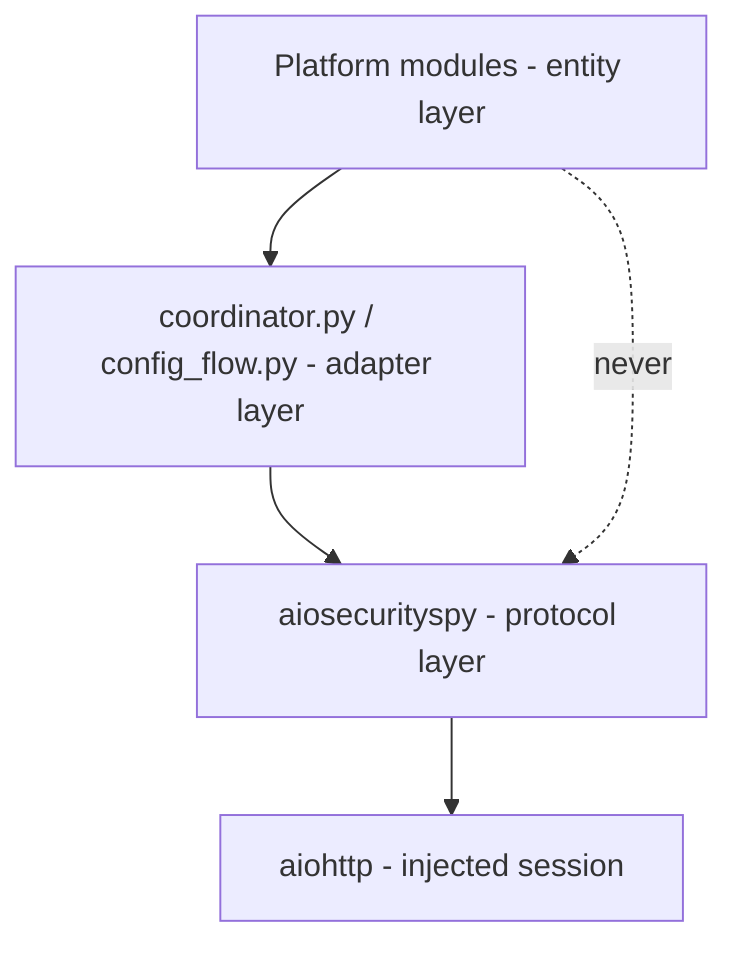
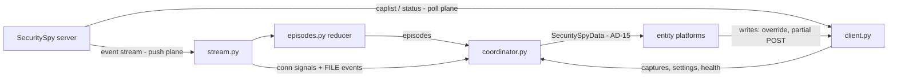

# Architecture Spine — ha-securityspy

## Design Paradigm

**Layered client/adapter with a two-plane data flow.** Three layers, one dependency direction:

1. **Protocol layer** — `aiosecurityspy` (PyPI): everything that knows SecuritySpy exists. Transport, framing, decoding, episode reduction, anonymization. No Home Assistant imports.
2. **Adapter layer** — `custom_components/securityspy/` core modules (`__init__`, `coordinator`, `config_flow`): owns lifecycle, maps library signals/exceptions to HA concepts, holds the single coordinator.
3. **Entity layer** — platform modules: thin declarative projections of coordinator data. No protocol knowledge, no I/O of their own.

Data flows on two planes with different jobs (AD-1): the **push plane** (event stream) drives latency-sensitive state; the **poll plane** (capture history / status endpoints) is the only source of persistent truth.



Entity modules may import library *types* (dataclasses, exceptions for isinstance) but never call library I/O; all calls go through the adapter layer.

## Invariants & Rules

### AD-1 — Two-plane data flow; poll plane is the only truth

- **Binds:** all (esp. FR-1..FR-4, FR-30, FR-31, NFR §11.3)
- **Prevents:** stream-accumulated persistent state that blanks on restart or drifts on stream loss — the predecessor's core defect.
- **Rule:** Every persistent value (Observation Record, Latest Capture state, control states) must be fully derivable from the poll plane alone. The push plane may only *advance* state the next poll would confirm, never be its sole source. On startup: hydrate from poll. On stream reconnect: reconcile from poll. The integration never assumes it is SecuritySpy's only client: server-side changes by other clients are truth, and locally-echoed control state yields to the next poll.

### AD-2 — All protocol knowledge lives in `aiosecurityspy` [ADOPTED]

- **Binds:** FR-40..FR-42, all features
- **Prevents:** protocol parsing leaking into the integration, blocking Bronze `dependency-transparency` and forcing the retrofit the PRD names as the fatal refactor; destructive server capabilities becoming reachable.
- **Rule:** CR-framed stream parsing, endpoint URLs, `caplist` field decoding (`f`+`s` → absolute time, `o` bitmask), permission/trigger bitmask decoding, schedule model, bool read/write asymmetry (JSON `true/false` read, `1/0` write), credential handling, and the diagnostics anonymizer live only in the library. The integration contains zero knowledge of SecuritySpy's wire formats. The library's public surface excludes SecuritySpy's destructive and remote-execution endpoints (capture deletion, shell/shortcut execution) entirely — not wrapped, not private-but-present.

### AD-3 — Detection-episode reduction is a library component

- **Binds:** FR-5..FR-8, FR-43, NFR §11.1
- **Prevents:** the integration (or a future consumer) re-implementing signal→episode semantics divergently; per-signal load reaching the HA state machine.
- **Rule:** The library ships a pure, configurable reducer: Classification Signals in → Detection Episodes out (open/close + Peak Confidence), with Detection Threshold and Detection Debounce injected per camera per class. The integration configures it from options and consumes episodes only. Raw signals never cross the adapter boundary. Motion presence uses the same reducer pattern with an inactivity timeout, never `MOTION_END`.

### AD-4 — One coordinator, push-fed, no `update_interval`

- **Binds:** FR-1..FR-11, FR-14, FR-30
- **Prevents:** two units inventing separate polling machinery or a hand-rolled data hub (the legacy `unifiprotect` shape).
- **Rule:** One `DataUpdateCoordinator` per Config Entry with `update_interval=None`, updated via `async_set_updated_data()` from (a) library stream callbacks and (b) polls the adapter schedules per AD-10. All entities subscribe to this coordinator; no entity performs its own I/O.

### AD-5 — Identity scheme (permanent) [ADOPTED]

- **Binds:** FR-19..FR-21, FR-29
- **Prevents:** duplicate/orphaned devices on rename or address change; irreversible unique-ID churn.
- **Rule:** Hub device `identifiers = {(DOMAIN, server_uuid)}`, `entry_type=SERVICE`. Camera device `identifiers = {(DOMAIN, f"{server_uuid}_{camera_number}")}`, `via_device` → hub. Never hostname, IP, camera name, or fabricated MACs; no `connections`. Entity unique IDs: `f"{server_uuid}_{camera_number}_{entity_key}"`; hub entities `f"{server_uuid}_{entity_key}"`, where hub entity keys are a reserved namespace no camera entity key may reuse. `_attr_has_entity_name = True` and a `translation_key` on every entity description. Config Entry `unique_id = server_uuid`.

### AD-6 — Single exception-mapping seam

- **Binds:** FR-25, FR-27, FR-30, FR-31, NFR §11.4
- **Prevents:** two platforms classifying the same failure differently; auth-failure flapping into reauth on one 401.
- **Rule:** The library raises its own typed hierarchy (`SecuritySpyAuthError`, `SecuritySpyConnectError`, `SecuritySpyPermissionError`, `SecuritySpyUnsupportedVersionError`); it never raises raw `aiohttp` errors and never imports HA. The adapter layer maps them exactly once: `ConfigEntryAuthFailed` per AD-18's counter, `ConfigEntryNotReady` for transient, `ConfigEntryError` for permanent — all with translation keys. Service handlers map user error → `ServiceValidationError`, operational failure → `HomeAssistantError`.

### AD-7 — Override and schedule are two operations, never one control [ADOPTED; split 2026-08-29]

- **Binds:** FR-12..FR-15
- **Prevents:** Home Assistant destroying user-built schedules in SecuritySpy; controls implying an indefinite HA-set state; and — since the split — a control that presents itself as a switch while silently reverting within six hours.
- **Rule:** The three arm switches write the Arm Override **exclusively**, and nothing bound to a switch ever sends `schedule=`. The override's transience (bounded at ≤ 6 hours or the next scheduled event, after which the Arm Schedule resumes) is reflected in entity state on the next poll and stated in docs and translation strings — never hidden. Schedule *assignment* is a **separate, explicitly invoked operation** governed by the split below. No code path creates, edits, or deletes a schedule **definition**, ever.
- **Split (Jensen, 2026-08-29):** *schedules and overrides are two different ideas, and one control cannot express both.* The original rule collapsed them by forbidding `schedule=` outright, which left the library with no operation for the thing SecuritySpy's own disarm button performs — `/++ssSetSchedule?cameraNum=N&schedule=0&override=-1&mode=CMA` (research §5.15.5). The two ideas separate as follows:
  1. **Override — transient, bounded, switch-driven.** "Arm this for two hours." Expressed by `override=`, never `schedule=`. This is what the arm switches write, and it is unchanged from the original decision, which §5.14 verified achievable exactly as stated.
  2. **Schedule assignment — persistent, explicit, never a switch.** "Disarm until I say otherwise." Expressed by assigning an existing schedule id to the selected capture modes. Permitted, but only through a deliberately invoked surface (a documented HA action, not an entity toggle) whose description states that it changes SecuritySpy's configuration.
- **What stays forbidden, and why (AD-20).** *A schedule is a thing SecuritySpy owns and exposes for Home Assistant to interact with — like a camera.* This is AD-20's boundary, not a rule invented for arming: Home Assistant does not create cameras in SecuritySpy; it discovers the ones that exist and acts on them, and schedules are the same kind of object. So the split permits *assigning* a schedule that already exists — including the built-in `0` (Disarmed 24/7) — and does **not** permit creating, editing, deleting, or reordering schedule definitions. That is the same boundary the integration already honors everywhere else, not a special case for arming, and it preserves this decision's original *Prevents* as a consequence rather than as a separate rule: a user's hand-built schedules survive because nothing this project does can alter them. Revisit only on demonstrated appetite (see Deferred).
- **No implicit restore.** Home Assistant never records a prior schedule assignment in order to silently put it back — that invents HA-resident state governing SecuritySpy, with no owner when HA is uninstalled, reinstalled, or restored from a backup taken mid-disarm. Reversal is symmetric and explicit: the prior assignment is readable per mode from `++systemInfo` and surfaced read-only (FR-15), so the user restores it by invoking the same operation with the id they can see.
- **Routing (AD-19).** `aiosecurityspy` has no schedule-assignment method today. The operation lands in the library first, with its own tests and OpenAPI entry, and the integration consumes it — never the reverse. Epic 6 does not move before that.

### AD-8 — Settings writes are direct partial POSTs [ADOPTED]

- **Binds:** FR-17, FR-18 (FR-16 superseded 2026-08-29; camera enablement is no longer a control)
- **Prevents:** read-modify-write caching and its lost-update races.
- **Rule:** Settings-backed controls (Detection Triggers, sensitivities) write a single-key partial POST on state change, verified non-destructive. No settings cache is held for write purposes; state reflects the next poll/echo per FR-14.

### AD-9 — Object Class is open string data, slugged once [ADOPTED]

- **Binds:** FR-34, FR-35, FR-6, event schema, AD-5 unique IDs
- **Prevents:** a three-value enum that locks out Custom Model users; unique-ID collisions or blueprint mismatches from ad-hoc class-name normalization.
- **Rule:** Object Class is `str` end-to-end — library models, reducer, event payloads, entity keys. `HUMAN/VEHICLE/ANIMAL` are constants, not a closed type. Unknown classes parse and carry without error; the event schema carries arbitrary classes from day one even though v1 creates entities only for built-ins. Wherever a class name enters a permanent key (unique ID, entity key, translation key), it passes through the library's single `class_slug()` normalization (lowercase, `[a-z0-9_]`); a class whose slug collides with an existing key is skipped with one warning, never silently merged.

### AD-10 — Observation Record polling shape

- **Binds:** FR-1..FR-4, FR-9..FR-11, §10.2, §11.1
- **Prevents:** cameras × classes request fan-out; poll storms per stream event.
- **Rule:** One reconciliation cycle = at most one `caplist` request per built-in Object Class, batched across all cameras (`cams=` list), bounded by the lookback window. Cycles run: at startup (non-blocking for setup per FR-2), on the library's reconnect signal, debounced after a `FILE` stream event, and on a slow fallback interval. Health polling uses the light status endpoint; the heavy endpoint only where a value requires it. `[ASSUMPTION: lookback window 7 days, fallback interval 10 minutes, FILE-event debounce 5 s.]`

### AD-11 — Stream lifecycle owned by the library

- **Binds:** FR-31..FR-33
- **Prevents:** reconnect/backoff logic split across layers; missed reconciliation on silent reconnects.
- **Rule:** The library's stream client owns CR framing, heartbeat watch (loss declared after 3 missed heartbeats ≈ 30 s), indefinite exponential backoff, and emits explicit `connected` / `disconnected` / `reconnected` / `auth_failed` callbacks. On `auth_failed` it pauses reconnection and defers to the adapter (AD-18). The adapter triggers AD-10 reconciliation on `reconnected`. Log discipline at the adapter: loss once at ERROR, retries at DEBUG, recovery once at WARNING. `disconnect()` is idempotent and cancels everything (FR-33).

### AD-12 — HA runtime conventions [ADOPTED]

- **Binds:** all integration code
- **Prevents:** drift from the machine-validated quality-scale rules; ONVIF coexistence breakage; devices going stale.
- **Rule:** Typed `SecuritySpyConfigEntry` alias + `entry.runtime_data`; never `hass.data[DOMAIN]`. `PARALLEL_UPDATES = 0` in every platform module. Services registered in `async_setup` (`action-setup`). Entity descriptions with `translation_key`; icons in `icons.json`. `iot_class: local_push`, `appropriate-polling` exempted with comment. Permission→entity gating happens once at setup (FR-28): no entity is created that the configured user cannot use; omissions raise repair issues. Camera (live video) entities are enabled by default and created only while the `create_camera_entities` option is on (FR-22); turning it off removes them. `EntityCategory.CONFIG` on arming, camera-enable, Detection Trigger, and sensitivity controls; `EntityCategory.DIAGNOSTIC` on health sensors; the update entity is read-only in v1. The device model follows Gold `dynamic-devices` / `stale-devices` patterns from Phase 1 (cameras appearing/disappearing on the server add/remove devices without reload) without committing the Gold tier.

### AD-13 — Credential and identity containment [ADOPTED; widened 2026-08-29]

- **Binds:** FR-42, §11.2
- **Prevents:** the observed live hazard — plaintext camera credentials in settings payloads and stream URLs reaching logs/diagnostics — and, since the widening, personally identifying network detail reaching a diagnostics dump that is attached to a public issue.
- **Rule:** Credential-bearing URLs are constructed only inside the library. Settings payloads are never logged at any level. Diagnostics output passes through the library's anonymizer as the only exit path; the anonymizer redacts usernames, passwords, tokens, and per-camera device credentials. Exception messages carry no credentials. The README documents a least-privileged SecuritySpy user as the recommended setup.
- **Widening (Jensen, 2026-08-29):** *anything that is PII, a secret, or a password is redacted or encrypted.* The rule is the category, not a list of field names, and it covers three things the original wording did not:
  1. **SecuritySpy's own application passwords.** `setPass`, `fsPass`, `quitPass` on `++settings-general` are real secrets that `is_credential_key` does not match (research §5.18.3).
  2. **Identifying network detail.** `server.wan-address` (a personal `*.viewcam.me` hostname) and `deviceList` (camera LAN IPs and ONVIF UUIDs) are not credentials but are PII-adjacent, and travel verbatim today (§5.11, §5.17.2).
  3. **The `auth=` query parameter in both its forms.** The base64 form *is* the account's username and password. **Amended (Jensen, 2026-09-13):** it may be constructed **only inside the library's RTSP relay**, attached to the relay's upstream connection to SecuritySpy, and is never returned from a public API, stored, or logged. Consumers receive either a relay address (`rtsp://<bind>:<port>/<random id>`) or `unsecured_stream_url()`, which carries no credential; attaching one to the latter is the caller's own act. The `!`-prefixed scoped token is a secret and is redacted like any other. **Under review (Jensen, 2026-09-16):** SecuritySpy 6.22b9 adds per-account API keys (`auth=API_…`, PRD Open Q11 reopened). An API key is a secret under this rule and is redacted like a password. Whether keys change the relay's upstream authentication or the consumer-facing surface is decided only after Story 1.21 verifies them; until then this amendment stands. The relay's credential-based upstream path is retained in any outcome, for servers without API keys.
- **Threat model:** the concern is **egress, not the LAN.** The cameras speak plain HTTP on the local network regardless, so on-network traffic is not what this guards. The rule governs everything that **can and will be shared**: diagnostics dumps, **log output at every level including debug**, issue reports, exception messages, and anything else a user copies out of Home Assistant. A debug log pasted into a GitHub issue is as public as a diagnostics dump.
- **Default is non-disclosure.** Nothing PII-, secret- or password-bearing is exposed in a shareable artifact **unless there is no other choice**. A field whose meaning is unknown is treated as identifying until shown otherwise, and adding a decoded field means deciding its disclosure class in the same change.
- **A necessary disclosure must be documented.** Where a value genuinely cannot be withheld — debugging is impossible without it, or a reduced form defeats the purpose — the exposure is deliberate, minimal (prefer a stable hash or a shape like `192.168.x.x` over the raw value), and **recorded in a disclosure register** naming the field, the artifact it appears in, why withholding it was not possible, and the reduced form used. An undocumented exposure is a defect regardless of how defensible it would have been.

### AD-14 — Two repositories; Bronze gates release, Silver gates announcement [ADOPTED]

- **Binds:** FR-36..FR-40, CI
- **Prevents:** HACS's one-integration-per-repo rule colliding with library CI; the predecessor's death pattern of a high bar blocking any release; an unannounced quality claim drifting from what CI verifies.
- **Rule:** `aiosecurityspy` (library repo: PyPI trusted-publisher OIDC release from semver tags, public CI, mypy `--strict` gate) and `ha-securityspy` (integration repo: hassfest + HA pylint plugin + HACS Action + pytest coverage in CI on every change). Both release via semver tags with GitHub Releases and a changelog. The HACS custom-repository release ships when the full Bronze rule set passes in CI; public announcement happens only when the full Silver rule set (including > 95 % coverage across integration modules) passes. The integration pins the library as a versioned dependency in `manifest.json`. `[ASSUMPTION: two repos, not a monorepo.]`

### AD-15 — Coordinator data contract

- **Binds:** all entity platforms, `coordinator.py`, library models
- **Prevents:** platforms, coordinator, and library each inventing incompatible shapes for shared data; string-vs-int camera keys.
- **Rule:** Coordinator data is one frozen, fully-typed `SecuritySpyData` container defined in the library's models: server state plus a `dict[int, CameraData]` keyed by SecuritySpy camera number (`int` everywhere — never stringly-typed). Per camera it carries: Observation Record timestamps per class, latest Capture, open Detection Episodes, control states, health, and per-camera availability (AD-17). The coordinator is the sole writer; entities read only this container.

### AD-16 — Push/poll merge is one watermark function

- **Binds:** FR-1..FR-3, FR-9, FR-10, AD-1, AD-15
- **Prevents:** the two planes both legitimately writing *last seen* / Latest Capture with no conflict rule — timestamps regressing or flickering between sources.
- **Rule:** All merges of push-derived and poll-derived state go through a single merge function in `coordinator.py`: incremental push updates may only advance a timestamp (monotonic watermark, max-wins); a full poll reconciliation is authoritative and overwrites, including regressions (e.g. captures deleted server-side). No other code path writes Observation Record or Latest Capture values.

### AD-17 — Three-layer availability, implemented once

- **Binds:** FR-30, FR-31, all platforms
- **Prevents:** each platform choosing its own availability definition (stream state vs poll success vs camera flag).
- **Rule:** Availability is computed in the shared base entities (`entity.py`) from `SecuritySpyData`, nowhere else. (1) Server unreachable — poll plane failing — → all entities of the entry unavailable. (2) A single camera offline (status-poll connected flag) while the server responds → only that Camera Device's entities unavailable, not an error. (3) Stream loss alone does **not** mark entities unavailable — the poll plane still holds truth — but push-derived presence entities (motion, per-class presence) become unavailable via a coordinator stream-health flag, since their liveness cannot be trusted. (4) **Camera absent from the permission-scoped inventory** — disabled, deleted, or de-permissioned in SecuritySpy, so no longer in `++systemInfo` — → that Camera Device's entities unavailable. Platforms never override `available` with their own logic.
- **On the fourth layer (added 2026-08-29, FR-16a).** It is a distinct cause: not a server failure, and the status-poll connected flag of layer 2 is unreadable because the camera is not in the permission-scoped payload at all. The three causes are **deliberately not distinguished** — Home Assistant has one thing to say about all of them, and telling them apart would need an unscoped endpoint and a guess in the direction that leaks. The device is **not removed automatically**: entities go unavailable while running, and a reload simply does not create the camera. Deleting a device is the user's act, not the integration's, and doing it on their behalf destroys recorder history on every transient permission change. The integration therefore implements `async_remove_config_entry_device` so the user *can* delete one — returning `True` only for a camera **absent from the current inventory**, and `False` for one still present, since layers 1-3 make a camera unavailable without it having gone anywhere and the next refresh would recreate it — the branch Home Assistant's 🥇 `stale-devices` rule prescribes when an integration cannot be sure a device is gone. Integrations whose absence is unambiguous (Tuya compares the account's device map at load and calls `async_remove_device`) may auto-remove; ours cannot, because absence here has three causes and two are transient.

### AD-18 — Auth-failure escalation has one owner

- **Binds:** FR-27, AD-6, AD-11
- **Prevents:** the "3 consecutive failures" reauth counter living in both planes — reauth never firing, or double-firing, or one 401 on either plane triggering it.
- **Rule:** The adapter owns a single consecutive-auth-failure counter fed by auth errors from **both** planes (poll exceptions and the stream's `auth_failed` callback). Any authenticated success on either plane resets it. At 3, the adapter raises `ConfigEntryAuthFailed` (starting reauth) and stops both planes; completing reauth restarts them. The library never counts, never persists auth state, and never initiates reauth.

### AD-19 — `aiosecurityspy` is the API library; the integration consumes it [ADOPTED]

- **Binds:** AD-2, AD-3, AD-11, AD-14, FR-40..FR-42, all features
- **Prevents:** the integration accumulating a private fork of protocol behaviour by copying, subclassing, or "just adding one wrapper" — the drift that makes the library's published surface a fiction and leaves two implementations of the same wire format to disagree.
- **Rule:** `aiosecurityspy` is the **single** implementation of the SecuritySpy API and the only thing that speaks to a SecuritySpy server. `ha-securityspy` **consumes** it as an ordinary versioned dependency. The integration must never copy library code into itself, never vendor a modified variant, and never subclass or wrap a library type to add, correct, or reinterpret protocol behaviour. If the library's behaviour is wrong or missing, the fix goes into the library — never a compensating workaround in the adapter.

  **Change routing is decided by what changed, not by which repo is convenient:**

  | The change is about | Where it goes |
  | --- | --- |
  | A SecuritySpy endpoint, wire format, decode, encode, or transport behaviour | `aiosecurityspy` |
  | The API description of the above | `aiosecurityspy/docs/securityspy-openapi.yaml`, in the same change |
  | A Home Assistant entity, service, config/options flow, coordinator, or HA UX | `ha-securityspy` |
  | An HA feature that needs data the library does not yet expose | Library change first, released and pinned; then the integration feature |

  The last row is the load-bearing one: an HA feature never reaches around the library to get what it needs. Epic 1's stories exist precisely because that ordering was enforced — the library gaps were found and scheduled ahead of the Epic 2/4/6 consumers that need them.

  **On the in-tree copy.** `ha-securityspy/aiosecurityspy/` is a development convenience, not a fork: the integration declares it as an editable path dependency so a library change is verified against the integration in the same commit, while `manifest.json` pins the released PyPI version as the runtime contract. Those two must agree at release. The in-tree tree is the working copy that is published *from*; it is never a place to hold integration-specific changes the published library does not have.

### AD-20 — SecuritySpy owns creation; the integration interacts [ADOPTED 2026-08-29]

- **Binds:** FR-12a, FR-15, FR-16, FR-19..FR-24; scope boundary for every future surface.
- **Prevents:** the integration drifting into a reimplementation of SecuritySpy's own UI, and Home Assistant becoming the owner of objects it cannot be the owner of — SecuritySpy is running whether Home Assistant is or not.
- **Rule (Jensen, 2026-08-29):** **This integration is not a second SecuritySpy UI.** SecuritySpy owns the *creation and definition* of its objects — cameras, schedules, and anything else it exposes. Home Assistant **discovers** those objects and **interacts** with them: reads their state, acts on them, and reflects changes back. It does not create them, does not define them, and does not delete them. Configuration of what a SecuritySpy object *is* happens in SecuritySpy; what it is *doing right now* is what Home Assistant reads and drives.
- **Applying it.** Cameras are the settled case and the model for the rest: the integration discovers cameras, creates devices for them, enables/disables and tunes them — and has never had a "add a camera" surface. AD-7's schedule split follows the same line: assigning an existing schedule is interaction, defining one is creation. When a new capability arrives, the question is not "can the endpoint do it" but **"is this creating a SecuritySpy object, or acting on one that exists?"** Creation is out by default; it takes a deliberate amendment here, not a story-level judgment call.
- **Not a capability ceiling.** This bounds *ownership*, not ambition — the integration can act on SecuritySpy's objects as richly as the API and the other ADs allow. A creation surface is deferred, not refused forever (see Deferred); it just cannot arrive by accident inside a story about something else.

## Consistency Conventions

| Concern | Convention |
| --- | --- |
| Entity keys / unique IDs | snake_case stable keys (`last_human_seen`, `arm_motion_capture`, `trigger_human`); unique ID per AD-5; class names in keys via `class_slug()` (AD-9); keys are permanent once released |
| Object Class in keys | class name embedded lowercase (`last_{class}_seen`, `{class}_detected`); generation parameterized over the class list, not copy-pasted per class |
| Timestamps | timezone-aware `datetime` (UTC internally) everywhere; absent = `None`, never epoch/zero; sensors use `device_class: timestamp` |
| Library models | frozen dataclasses, fully typed, `from_api()` constructors; raw dicts never cross the library boundary |
| Event payloads | keys: `object_class` (str), `peak_confidence` (int 0–100), `camera_number` (int), `capture_ref` (nullable), `trigger_reason` (decoded str, never bitmask); the Latest Capture's detected-class set is an empty list when none, never absent |
| Config vs options | connection + credentials in Config Entry data; tuning in options as a typed options dataclass — global keys (threshold, debounce, motion timeout, lookback) plus `cameras: dict[int, PerCameraOptions]` overrides — owned by `config_flow.py`, consumed by the coordinator via update listener without reload |
| Services | `download_latest_recording` validates the destination against `allowlist_external_dirs`; user error → `ServiceValidationError`, operational failure → `HomeAssistantError`, translation keys on both |
| Logging | module loggers; loss/recovery once per AD-11; no payload logging; DEBUG never includes settings bodies |
| Tests & typing | library: no HA imports, protocol fixtures from HAR/recorded frames, mypy `--strict`; integration: pytest + `pytest-homeassistant-custom-component`, fixtures from anonymized real captures, ruff + mypy on both repos |
| Blueprints | the two canonical blueprints are the entity-model design test: drafted early against the Phase-3 entity surface; an awkward blueprint is an entity-model defect, not a blueprint problem |
| Docs vocabulary | PRD Glossary §4 terms verbatim in code comments, docs, and translation strings |

## Stack

| Name | Version |
| --- | --- |
| Python | ≥ 3.14 (HA 2026.3+ floor; library `requires-python >= 3.14`) |
| Home Assistant (min declared) | 2026.3 `[ASSUMPTION]` (current 2026.8.1; 2026.3 is the Python-3.14 boundary) |
| aiohttp | caller-injected session (HA's); library declares `>=3.12,<4` (current 3.14.3) |
| Build backend | hatchling, `src/` layout, `pyproject.toml` only |
| Tooling | uv (env/lock/publish via OIDC `id-token: write`), ruff, mypy |
| Integration test kit | pytest + pytest-homeassistant-custom-component (0.13.x, active) |
| CI | GitHub Actions: hassfest + HA pylint plugin + HACS Action (integration); build/typecheck/publish (library) |
| Distribution | PyPI (`aiosecurityspy`, name verified free 2026-08-09 — register early); HACS custom repository (integration) |

## Structural Seed

```text
aiosecurityspy/                    # repo 1 — protocol layer
  src/aiosecurityspy/
    client.py        # SecuritySpyClient: REST calls, injected session
    stream.py        # event-stream client: CR framing, heartbeat, backoff, callbacks
    episodes.py      # pure signal→episode reducer (threshold/debounce injected)
    models.py        # frozen dataclasses: SecuritySpyData, Server, CameraData, Capture, Permissions, Schedule, Event
    const.py         # endpoints, bitmasks, built-in class constants, class_slug()
    exceptions.py    # typed hierarchy (AD-6)
    anonymize.py     # diagnostics redaction (AD-13)

ha-securityspy/                    # repo 2 — integration
  custom_components/securityspy/
    __init__.py      # setup/unload, runtime_data, exception mapping (AD-6), auth counter (AD-18)
    coordinator.py   # the single coordinator (AD-4), watermark merge (AD-16), reconciliation scheduling (AD-10)
    config_flow.py   # user/reauth/reconfigure steps, HTTPS verify toggle, options flow
    entity.py        # base entities (hub/camera), device_info per AD-5, availability per AD-17
    diagnostics.py   # via library anonymizer only
    repairs.py       # permission omissions, default-install trap (FR-45)
    services.py      # download_latest_recording (FR-44)
    {sensor,binary_sensor,event,image,switch,select,number,camera,update}.py
    icons.json / strings.json / translations/
  blueprints/automation/securityspy/   # the two canonical blueprints (FR-37)
  hacs.json / README.md
```



## Capability → Architecture Map

| Capability / Area | Lives in | Governed by |
| --- | --- | --- |
| Observation Record (FR-1..4) | `client.py` caplist + `coordinator.py` → `sensor.py` | AD-1, AD-10, AD-15, AD-16 |
| Live detection (FR-5..8, 43) | `stream.py` + `episodes.py` → `binary_sensor.py`, `event.py` | AD-3, AD-9, AD-17 |
| Latest Capture + download (FR-9..11, 44) | `client.py` → `image.py`, `services.py` | AD-1, AD-10, AD-16, services convention |
| Arming + schedule visibility (FR-12, FR-12a, FR-13..16) | `switch.py`, `select.py`, `services.py` | AD-7, AD-8, AD-12, AD-19 |
| Detection tuning + trap (FR-17, 18, 45) | `number.py`, `switch.py`, `repairs.py` | AD-8, AD-12 |
| Device model (FR-19..24) | `entity.py`, platform modules | AD-5, AD-12 |
| Setup/connection (FR-25..29) | `config_flow.py`, `__init__.py` | AD-6, AD-18, AD-5 |
| Resilience (FR-30..33) | `stream.py` + `coordinator.py` + `entity.py` | AD-11, AD-17, AD-1 |
| Custom Model (FR-34, 35) | schema everywhere; entities spike-gated | AD-9 |
| Distribution/quality (FR-36..39) | repo layout, CI, blueprints | AD-14, AD-12, blueprints convention |
| Library (FR-40..42) | `aiosecurityspy` | AD-2, AD-13 |

## Deferred

- **Custom Model entity-creation mechanism (FR-35)** — spike-gated on payload discovery; AD-9 keeps the schema and key-space safe meanwhile. Auto-defers to v2 if the spike cannot run.
- **Default Detection Threshold / Debounce values** — provisional 70% / 3 signals, motion timeout 30 s; tuned against real footage before release (PRD Open Q5). Options-flow adjustable, so not load-bearing.
- **Reconciliation freshness bound** — gated on the Phase-2 spike (classification write timing, PRD Open Q3); AD-10's shape is unaffected, only the honest latency claim.
- **Media source browser, clip service, PTZ, manual trigger, audio, capture tagging** — v2 candidates; nothing in the seed forecloses them (clip/media reuse `client.py` + `getfile` Range support). Any future clip service must clean up or expose deletion — but via new, deliberate surface, not by relaxing AD-2's exclusion.
- **Creation surfaces for SecuritySpy-owned objects — schedule definitions first among them** — deliberately out per AD-20: the integration interacts with what SecuritySpy owns, it does not define it. Schedule *assignment* (FR-12a) covers the arming need without any definition surface. Revisit only on demonstrated user appetite, and as an AD-20 amendment rather than inside a feature story; nothing in AD-7 or AD-20 forecloses the larger surface.
- **Multi-server** — out for v1; AD-5's uuid-prefixed identity already leaves room.
- **Resource-scoped auth tokens / API keys** — superseded 2026-09-13 by the library RTSP relay (AD-13 item 3, FR-22) because tokens needed a manual paste per camera. **Reopened 2026-09-16:** SecuritySpy 6.22b9 adds per-account API keys (PRD Open Q11); spike-gated on Story 1.21. Any adoption is additive; the relay and credential path stay for servers older than 6.22.
- **HACS default-store listing and brands PR** — post-launch; start the brands PR early but nothing downstream depends on it.
- **Gold/Platinum tier commitment** — Platinum's library constraints and Gold's device-lifecycle patterns are already ADs; the tier decisions themselves are deferred.
- **SecuritySpy minimum-version floor** — assumed 6.x; verify the earliest sufficient 6.x release before hardcoding the check (PRD Open Q8).
- **Repair-issue fine behavior (FR-45 dismissal/recurrence)** — code-level detail within `repairs.py`; the trap-detection requirement itself is mapped.
