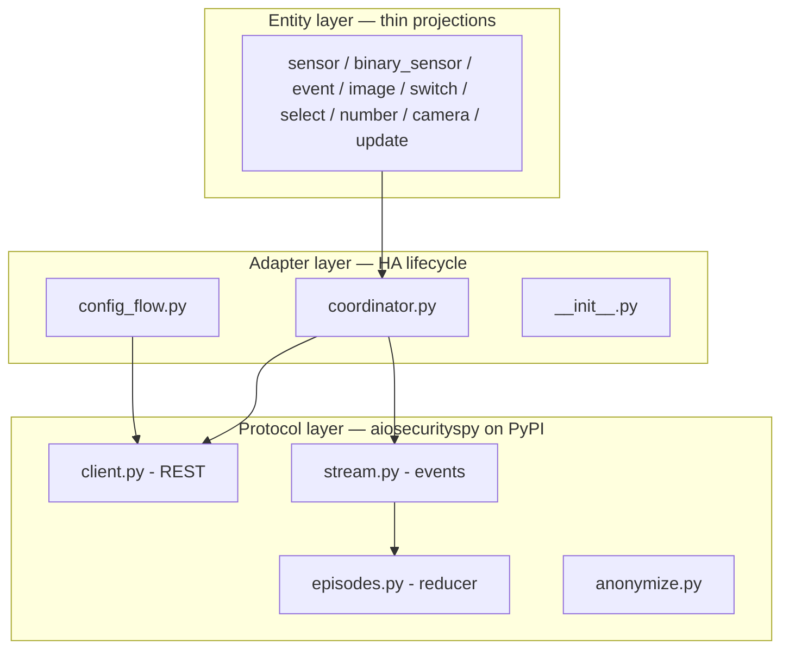

# Solution Design — SecuritySpy Home Assistant Integration

This is the readable companion to the [architecture spine](ARCHITECTURE-SPINE.md). The spine is the contract — terse decisions (AD-1…AD-18) that downstream work must obey. This document explains the same architecture as a story: what the system is, why it is shaped this way, and how the pieces cooperate. Where the two disagree, the spine wins.

## The problem in one paragraph

SecuritySpy classifies humans, vehicles, and animals in real time and stores those classifications against every recording — and Home Assistant sees none of it. The previous integration accumulated state from SecuritySpy's live event stream, which is lossy, per-connection, and has no replay: every Home Assistant restart blanked everything it knew. The central design move here is to stop trusting the stream. SecuritySpy's own capture history already holds the truth, persistently, with server-side class filtering. The stream makes things *fast*; the capture history makes things *true*.

## The shape: two planes, three layers

### Two data planes

| | Push plane (event stream) | Poll plane (capture history / status) |
|---|---|---|
| Character | sub-second, lossy, no replay | authoritative, persistent, self-healing |
| Drives | presence sensors, detection events, motion | Observation Record, Latest Capture, control state, availability |
| Failure mode | silently misses things | at worst, briefly stale |

The rule that governs everything (**AD-1**): every persistent value must be fully derivable from the poll plane alone. The push plane may only *advance* state that the next poll would confirm. On startup, hydrate from poll. On reconnect, reconcile from poll. This single rule is what makes the Observation Record — *last human / vehicle / animal seen, per camera* — correct immediately after a restart and self-healing after an outage, which is the headline requirement (FR-1…FR-3).

Where the two planes both want to write the same value (a `FILE` event says there's a new capture; so does the next poll), one watermark-merge function in the coordinator arbitrates (**AD-16**): push may only move timestamps forward; a full poll reconciliation overwrites authoritatively, even backwards (captures can be deleted server-side).

### Three layers

1. **`aiosecurityspy`** — a standalone, typed, async PyPI library that owns *everything that knows SecuritySpy exists*: the CR-framed stream protocol, endpoint URLs, field and bitmask decoding, the signal→episode reducer, credential handling, and the diagnostics anonymizer (**AD-2**). It has no Home Assistant imports and is independently usable — which is both a Bronze quality-scale requirement and the project's durable contribution, since no maintained SecuritySpy library exists anywhere.
2. **The adapter** — the integration's core: one `DataUpdateCoordinator` per server with no polling interval of its own (**AD-4**), fed by stream callbacks and explicitly-scheduled polls; the single place library exceptions become HA behavior (**AD-6**); the single owner of the auth-failure counter that triggers reauthentication (**AD-18**).
3. **Entities** — declarative projections of one frozen, typed data container (**AD-15**). No entity performs I/O or holds protocol knowledge. Availability is computed once, in the shared base classes, with three layers (**AD-17**): server down → everything unavailable; one camera offline → just that device; stream down → only push-derived presence entities, because the poll plane still holds truth.

## Decisions worth explaining

**Why episodes, not events.** The raw stream emits ~190 classification signals for one person crossing a driveway, with confidence swinging 4→100. The library reduces signals into *Detection Episodes* — threshold plus debounce, configurable per camera per class — and the integration consumes only episodes (**AD-3**). One episode yields one HA event carrying peak confidence, and one presence-sensor transition. The ~190:1 reduction is a requirement, not an optimization: per-signal writes to the HA state machine are a defect.

**Why arming writes overrides, never schedules (AD-7).** SecuritySpy schedules are user-built configuration; writing them from HA would destroy it. Overrides are transient (≤ 6 hours or the next scheduled event) and exactly right for automation-driven arming. The active schedule is shown read-only. The transience is surfaced, not hidden — HA never pretends an override is permanent.

**Why identity is uuid + camera number (AD-5).** Names are user-editable, IPs change, and SecuritySpy cameras may have no MAC. The server UUID plus camera number is the only stable pair, and identity decisions are effectively permanent — changing them orphans every customization a user has made. This also quietly leaves room for multi-server support later.

**Why the class vocabulary is open (AD-9).** Users can load custom CoreML models that emit arbitrary classes. Class is a string everywhere — models, events, entity keys (via one `class_slug()` normalizer) — so supporting a new class never changes the event schema or breaks an automation. v1 creates entities only for human/vehicle/animal; the schema carries everything from day one.

**Why polling doesn't fan out (AD-10).** Naive polling is cameras × classes requests — 33 per cycle on the reference system. Instead: one batched `caplist` request per class across all cameras, bounded to a lookback window, triggered by `FILE` stream events (debounced), reconnects, startup, and a slow fallback — not a fixed fast interval.

**Why two repos (AD-14).** HACS requires exactly one integration per repository, and the library needs its own PyPI trusted-publisher CI. Release discipline is asymmetric by design: the HACS release ships when **Bronze** passes in CI; public announcement waits for **Silver** (including > 95 % test coverage). This ordering exists because the predecessor died of maintainer fatigue — a smaller surface that ships beats a perfect one that doesn't.

**Safety is structural, not procedural.** SecuritySpy's settings endpoint returns camera credentials in plaintext, and its API exposes capture deletion and shell execution. So: credential-bearing URLs are built only inside the library, settings payloads are never logged at any level, diagnostics pass through the library's anonymizer as their only exit (**AD-13**), and the destructive/remote-execution endpoints are simply absent from the library's surface (**AD-2**) — you cannot call what doesn't exist.

## What was deliberately not decided

The spine defers, with reasons: Custom Model entity creation (spike-gated on an undocumented payload), the exact tuning defaults (options-adjustable, tuned against real footage before release), reconciliation freshness claims (gated on the classification-write-timing spike), media browsing and clip extraction (v2 candidates the seed doesn't foreclose), multi-server, auth tokens, and the Gold/Platinum tier commitments (their cheap-now constraints are already adopted; the commitments aren't).

## How a story-writer should use this

Build order follows the PRD's phases: library → connect/model → Observation Record → live detection → controls → ship. Every story inherits the spine's ADs as binding; the Capability → Architecture Map in the spine says which ADs govern which FRs. If a story seems to need a decision the spine doesn't make, that's either genuinely deferred (check Deferred) or a hole — surface it, don't invent it. And the two blueprints are the standing design test: if one is awkward to write, the entity model is wrong, and that's a defect to fix before shipping.
